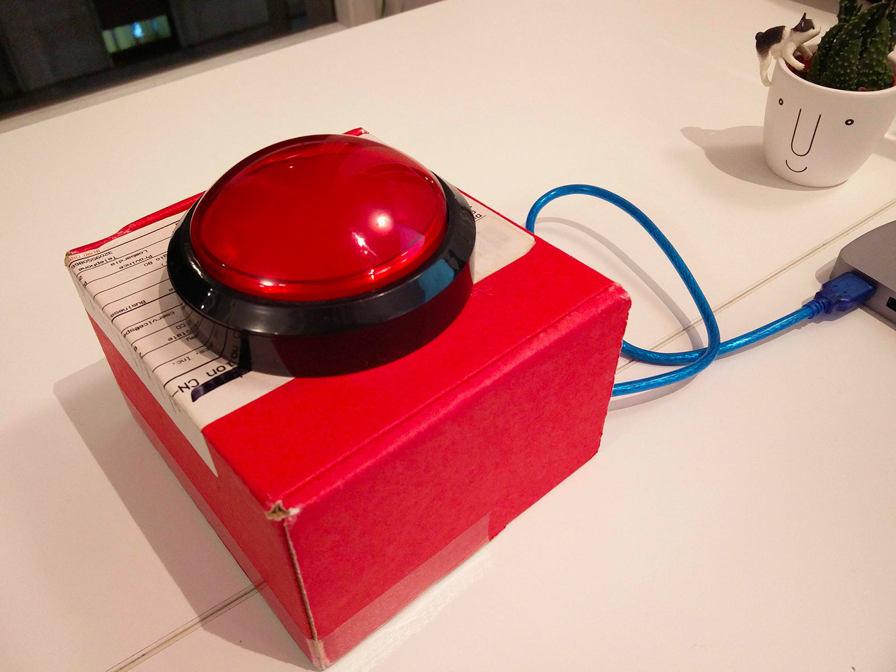

# big-red-button

> A big red button that does things when pressed.

It is powered by an **Arduino Uno**, you can order the big button from [here](https://www.sparkfun.com/products/9181), and read the instruction on how to assemble the circuit [here](https://www.instructables.com/id/5-Simple-Button-and-Led-Projects-with-Arduino/).



## Installation
```
yarn
```

## Usage
```
yarn start
```

## Examples
You can trigger keyboard keys using [robotjs](https://github.com/octalmage/robotjs)
```js
robot.keyTap('enter')
```

You can trigger a mouse click
```js
// BUG robot.mouseClick() doesn't work on multiple screens
// so first you have to do `brew install cliclick`
exec('cliclick c:.')
```

You can play an audio
```js
// 💻 this works only on mac
exec(`afplay /Users/Marco/Desktop/audio.mp3`)
```

You can make you computer say something
```js
// 💻 this works only on mac
exec(`say stocazzo`)
```

You can send a message to a slack channel using the integration `incoming-webhook`
```js
const got = require('got')

// the HOOK_URL is provided by the integration
const HOOK_URL = ''
got.post(HOOK_URL, {
  body: JSON.stringify({
    username: 'RED BUTTON',
    text: `I've been pressed!`,
    icon_url: 'https://i.imgur.com/9PpFcY8.jpg'
  })
})
```

## Troubleshooting

> The keypress commands are being launched but nothing is happening, wtf??

If you're on a mac, you probably forgot to give permissions to your console application.

Go into `Preferences > Security & Privacy > Accessibility` and make sure the terminal app you're using is checked.